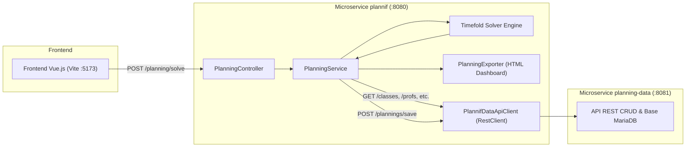

# 📋 Notes d'Architecture et Synthèse Technique — Projet `plannif`

> **Note persistante pour l'agent IA et les développeurs** : Ce document constitue la référence technique consolidée du projet `plannif`. Il permet de comprendre immédiatement le fonctionnement, les règles métier, les contraintes Timefold, les flux de données et la structure du code sans avoir à re-parser l'ensemble du projet.

---

## 1. 📌 Identité & Rôle du Projet

- **Nom du projet** : `plannif` (Package racine : `fr.manaken.plannif`)
- **Type** : Microservice Spring Boot dédié au calcul d'optimisation combinatoire et à la génération d'emplois du temps scolaires.
- **Moteur d'optimisation** : [Timefold Solver](https://timefold.ai/) `1.27.0` (ex-OptaPlanner).
- **Stack technique** :
  - **Java** : version 25
  - **Spring Boot** : 3.5.6 (Web, Starter Test)
  - **Timefold Solver** : `timefold-solver-core` & `timefold-solver-test` (1.27.0)
  - **MapStruct** : 1.6.3 (Binding Lombok-MapStruct `0.2.0`)
  - **Lombok** : 1.18.42
  - **Build Tool** : Maven (`pom.xml`)

---

## 2. 🌐 Architecture & Écosystème

Le projet `plannif` s'intègre dans une architecture multi-services :



### Configuration réseau (`application.yml`)
- Port serveur `plannif` : `8080`
- URL service distant `plannif-data` : `http://localhost:8081/planning-data` (`plannif-data.api.base-url`)
- Paramètres métier configurables :
  - `planning.standard-session-duration-hours` : `2.0` (heures par défaut par séance lors de la génération)
  - `planning.solver.spent-limit-seconds` : `120` (temps max solver)

---

## 3. 🧩 Arborescence du Code Source

```
src/main/java/fr/manaken/plannif/
├── PlannifApplication.java               # Point d'entrée Spring Boot
├── business/                             # Cœur Timefold (Solution & Contraintes)
│   ├── Planning.java                     # @PlanningSolution (Agrégat de résolution)
│   └── PlanningConstraints.java          # @ConstraintProvider (17 contraintes de score)
├── client/data/                          # Client REST vers planning-data
│   ├── PlannifDataApiClient.java         # RestClient Spring 6 pour tous les endpoints
│   ├── config/PlannifDataClientConfig.java # Configuration du Bean RestClient
│   ├── dto/                              # DTOs (ClasseDto, SeanceDto, PlanningDto, etc.)
│   └── mapper/                           # Mappers MapStruct (entité <-> DTO)
├── controller/
│   └── PlanningController.java           # Endpoints REST (/planning/solve, /planning/solve-html)
├── exporter/
│   └── PlanningExporter.java             # Générateur de Dashboard HTML / diagramme de Gantt interactif
├── model/                                # Modèles du domaine
│   ├── Classe.java                       # Classe scolaire, liste presences
│   ├── ClassePresence.java               # Période de présence obligatoire [dateDebut, dateFin], calculs firstDay/lastDay et validation isValidVieDeClasse
│   ├── DistanceSalle.java                # Matrice des distances entre salles
│   ├── Eleve.java                        # Élève rattaché à une Classe
│   ├── Equipement.java                   # Matériel / ressource
│   ├── EquipementSalle.java              # Association Salle <-> Équipement
│   ├── Matiere.java                      # Discipline enseignée
│   ├── MatiereClasseConfig.java          # Volume horaire et période obligatoire d'une matière pour une classe
│   ├── PlageHoraire.java                 # Plage horaire préférée prof
│   ├── Professeur.java                   # Enseignant (quotas heures max/jour, max/semaine, max/séance)
│   ├── ProfesseurDayOff.java             # Jour de repos enseignant (0=Lundi..4=Vendredi)
│   ├── Salle.java                        # Salle de cours avec code, capacité, type
│   ├── Seance.java                       # @PlanningEntity avec variables debut, salle, professeur, et fin calculée
│   ├── SemaineType.java                  # Enum SEMAINE_1, SEMAINE_2, SEMAINE_3
│   ├── TeacherClassWork.java             # Objet utilitaire Timefold pour calculs de charge prof/classe
│   └── Vacances.java                     # Plage de dates de vacances scolaires
└── service/
    └── PlanningService.java              # Orchestration, génération dates/séances, sauvegarde
```

---

## 4. 🧠 Modèle de Résolution Timefold

### Entités & Variables
1. **Planning Solution** : `Planning`
   - Score type : `HardSoftScore` (pénalités Hard pour les impossibilités strictes, Soft pour le confort/optimisation).
   - `@PlanningEntityCollectionProperty` : `List<Seance> seances`
   - `@ProblemFactCollectionProperty` & `@ValueRangeProvider` :
     - `datesDebutPossibles` (id: `"dateDebutRange"`) : `List<LocalDateTime>` représentant tous les horaires de début de séance admissibles
     - `salles` (id: `"salleRange"`)
     - `professeurs` (id: `"professeurRange"`)
   - Autres Facts : `classes`, `matieres`, `professeurDayOffs`, `classePresences`, `matiereClasseConfigs`, `vacances`.

2. **Planning Entity** : `Seance`
   - Clé de planning : `@PlanningId Long id`
   - Variables de décision (attribuées par le solver) :
     - `@PlanningVariable(valueRangeProviderRefs = "dateDebutRange") LocalDateTime debut`
     - `@PlanningVariable(valueRangeProviderRefs = "salleRange") Salle salle`
     - `@PlanningVariable(valueRangeProviderRefs = "professeurRange") Professeur professeur`
   - Attributs calculés / fixes :
     - `fin` : calculé automatiquement à partir de `debut` et de la durée (`debut.plusMinutes(getDureeMinutes())`)
     - `dureeMinutes` : 90 min pour `TP`, 60 min pour les autres types (`COURS`, `EXAMEN`, `VIE_DE_CLASSE`)
     - `classe`, `matiere`, `type`

---

## 5. 📏 Catalogue Complet des Contraintes (`PlanningConstraints`)

Le solver évalue **17 contraintes** (9 Hard, 8 Soft) :

### 🔴 Contraintes Strictes (Hard Constraints - 1 Hard point par violation)
| # | Nom | Méthode | Règle / Description |
|---|---|---|---|
| 1 | **Room Conflict** | `roomConflict` | Pas de chevauchement temporel de deux séances dans la même salle (`s1.debut < s2.fin && s1.fin > s2.debut`). |
| 2 | **Teacher Conflict** | `teacherConflict` | Un même enseignant ne peut pas animer deux séances en même temps. |
| 3 | **Student Group Conflict** | `studentGroupConflict` | Une même classe ne peut pas avoir deux séances simultanées. |
| 4 | **Student Group Presence** | `studentGroupPresence` | Toute séance d'une classe doit obligatoirement tomber dans une période où la classe est présente (`ClassePresence`). |
| 5 | **Teacher Must Be Qualified** | `teacherMustBeQualified` | Le professeur assigné à la séance doit avoir la matière dans ses compétences (`prof.getMatieres().contains(matiere)`). Exception pour `VIE_DE_CLASSE`. |
| 6 | **Subject Class Period** | `subjectClassPeriodConstraint` | Si un module a une plage de dates définie dans `MatiereClasseConfig`, la séance doit être comprise entre `dateDebut` et `dateFin`. |
| 7 | **Holiday Conflict** | `holidayConflict` | Aucune séance ne peut avoir lieu pendant une période de vacances (`Vacances`). |
| 8 | **Vie de Classe Timing** | `vieDeClasseTimingConstraint` | Une séance `VIE_DE_CLASSE` doit obligatoirement être placée soit sur le **premier jour (09h00 - 10h00)**, soit sur le **dernier jour (10h00 - 11h00)** de la période de présence (permettant le placement conjoint d'une séance le premier jour ET d'une séance le dernier jour). |
| 9 | **Seance Type & Duration Match** | `seanceTypeDurationMatch` | Une séance de type `TP` doit durer exactement **90 minutes**, les autres types ne doivent pas durer 90 minutes (séances standard 1h). |

### 🟡 Contraintes Souples (Soft Constraints - 1 Soft point par violation)
| # | Nom | Méthode | Règle / Description |
|---|---|---|---|
| 1 | **Teacher Day Off** | `teacherDayOff` | Ne pas planifier un professeur sur son jour de congé hebdomadaire (`ProfesseurDayOff`, 0=Lundi..4=Vendredi). |
| 2 | **Teacher Max Hours / Day** | `teacherMaxHoursPerDay` | Ne pas dépasser le quota d'heures par jour du professeur (`maxHeuresParJour`). |
| 3 | **Teacher Max Hours / Week** | `teacherMaxHoursPerWeek` | Ne pas dépasser le quota d'heures par semaine du professeur (`maxHeuresParSemaine`). |
| 4 | **Teacher Max Hours / Session** | `teacherMaxHoursPerSession` | Ne pas dépasser la durée max par séance du professeur (`maxHeuresParSeance`). |
| 5 | **Teacher-Class 2-Days Limit** | `teacherClassMaxHoursConsecutive` | Un professeur ne doit pas donner plus de 5 heures de cours à une même classe sur 2 jours consécutifs. |
| 6 | **Teacher Max Gap** | `teacherMaxGap` | Éviter les trous de plus de 2 heures (120 min) dans l'emploi du temps d'une même journée pour un professeur. |
| 7 | **Max Sessions / Day / Subject** | `subjectClassMaxSessionsPerDay` | Maximum 1 séance d'une même matière par jour pour une classe donnée. |
| 8 | **Subject Class Spreading** | `subjectClassSpreading` | Éviter de planifier la même matière deux jours consécutifs (distance <= 1 jour) pour favoriser l'espacement pédagogique. |

---

## 6. ⚙️ Logique Métier & Algorithmes Clés (`PlanningService`)

### 1. `buildPlanning()`
- Appelle `PlannifDataApiClient` pour récupérer l'ensemble des données de référence.
- Initialise les listes de relations bidirectionnelles (`ClassePresence`, `ProfesseurDayOff`, `Vacances`).
- Ré-associe en mémoire les objets référencés par ID (`Classe`, `Professeur`, `Matiere`, `Salle`).
- Récupère les débuts candidats si disponibles depuis l'API ou génère les dates de début possibles dans `Planning.datesDebutPossibles`.

### 2. `generateDatesDebutPossiblesIfNeeded(Planning planning)`
- Parcourt chaque `ClassePresence` (jours ouvrés lundi à vendredi, hors vacances) :
  - **Créneaux 1h standard** :
    - Matin : 8h (sauf lundi), 9h, 10h, 11h
    - Après-midi (sauf vendredi) : 13h, 14h, 15h, 16h
  - **Créneaux 1h30 (TP)** :
    - Matin : 8h (sauf lundi), 9h30, 11h
    - Après-midi (sauf vendredi) : 13h, 14h30, 16h

### 3. `generateSeancesIfNeeded(Planning planning)`
- À partir de `MatiereClasseConfig` :
  - Calcule `count = round(volumeHorairePeriode / standardSessionDurationHours)`.
  - Instancie les `Seance` avec `classe` et `matiere` assignées, `professeur`, `salle` et `debut` non initialisés (laissés au Solver).
- Gestion des **Vie de Classe** :
  - Génère **2 séances `VIE_DE_CLASSE`** par période de présence de la classe : une séance pour le **premier jour (09h00 - 10h00)** ET une séance pour le **dernier jour (10h00 - 11h00)**.
  - Réutilise les séances `VIE_DE_CLASSE` non planifiées existantes ou crée de nouvelles séances avec la matière auto-générée `"Vie de classe"`.

---

## 7. 🧪 Suite de Tests & Qualité

La suite comprend **39 tests unitaires et d'intégration** (tous au vert) :
- `ConstraintVerifierTest` (14 tests) : Teste isolément chaque contrainte Timefold via `ConstraintVerifier`.
- `AdvancedSolverTest` (4 tests) : Validation du calcul de score et détection des conflits (salle, prof, présence classe).
- `SolverTest` (1 test) : Test d'intégration de résolution complète avec assertion sur la faisabilité (`isFeasible() == true`).
- `PlanningControllerTest` (5 tests) : Test de l'orchestration globale, chargement de scénarios JSON, génération dynamique, persistance et propagation de la date/heure de fin (`fin`), et export Gantt HTML.
- `PlannifDataApiClientTest` (8 tests) : Validation des appels HTTP avec MockRestServiceServer.
- `MappersTest` (6 tests) : Validation des mappers MapStruct (dont mapping direct de `debut` et `fin` dans `SeanceDto`).
- `PlannifApplicationTests` (1 test) : Chargement du contexte Spring Boot.
